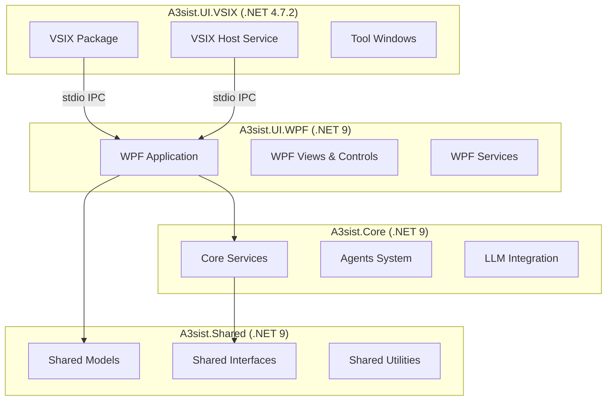
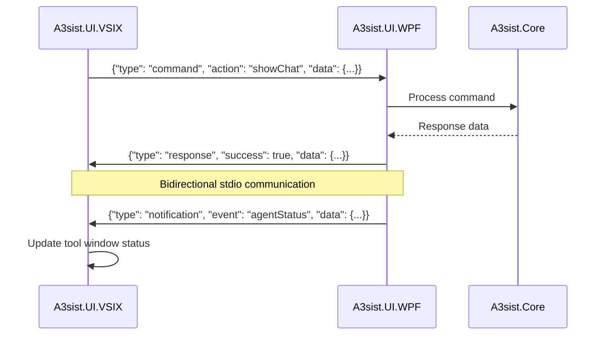
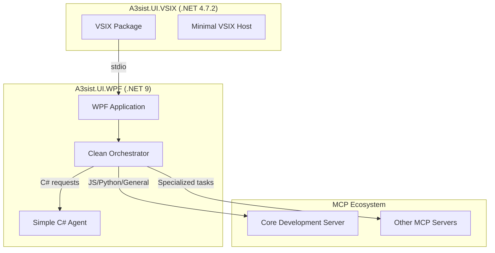
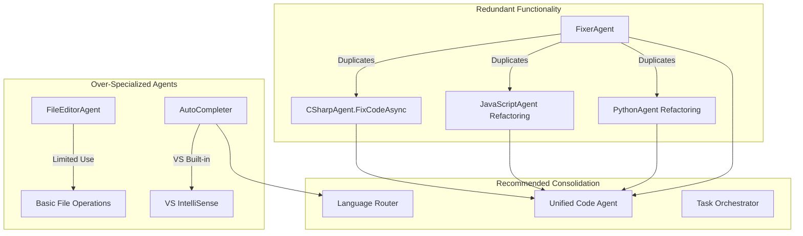
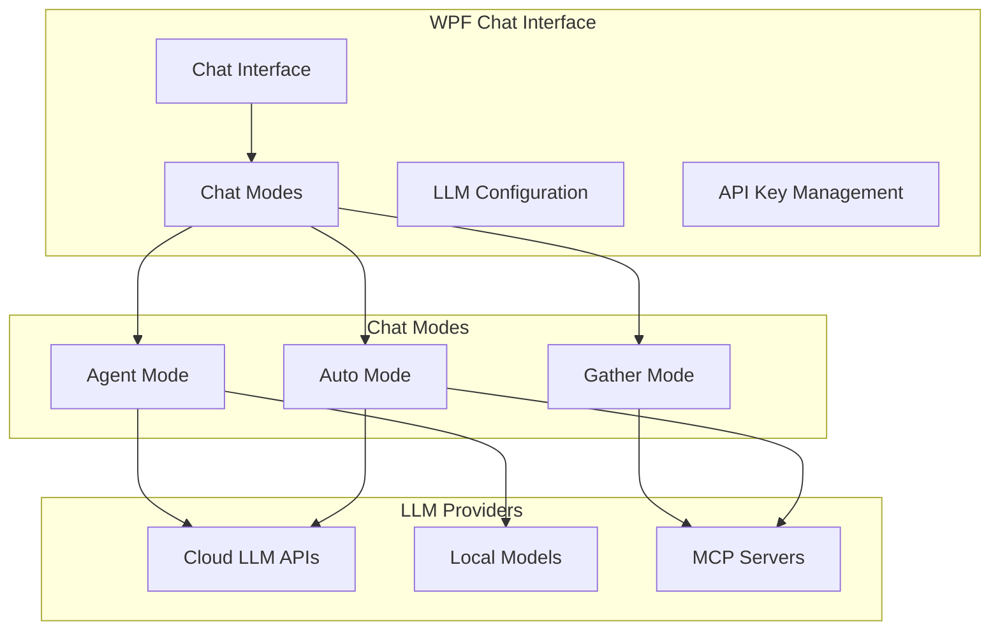
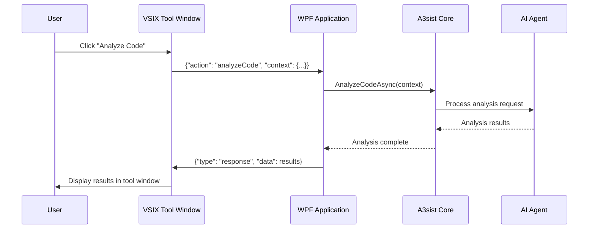
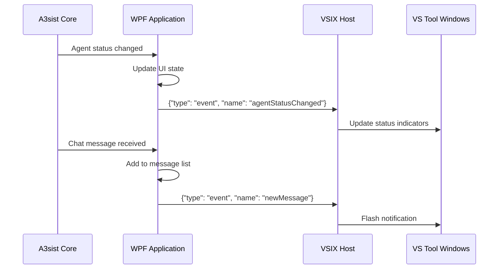

# A3sist WPF UI Integration Design

## Overview

This design outlines the conversion of A3sist's UI architecture from MAUI to WPF, implementing a modernized framework approach where the VSIX package targets .NET 4.7.2 for Visual Studio compatibility, while all other components target .NET 9. The design includes a stdio-based inter-process communication (IPC) system to bridge the VSIX host and the modern WPF application.

## Architecture

### Framework Targeting Strategy



### Component Separation

The architecture separates concerns between two primary UI components:

1. **A3sist.UI.VSIX** (.NET 4.7.2): Minimal Visual Studio integration layer
2. **A3sist.UI.WPF** (.NET 9): Modern WPF application with full UI functionality

## Technology Stack

### VSIX Component (.NET 4.7.2)
- **Framework**: .NET Framework 4.7.2
- **UI Technology**: Minimal WPF hosting
- **Communication**: System.IO.Pipes for stdio
- **Dependencies**: Visual Studio SDK, minimal core references

### WPF Application (.NET 9)
- **Framework**: .NET 9
- **UI Technology**: WPF with modern XAML features
- **Communication**: System.IO.Pipes for stdio
- **Dependencies**: Full core services, agent system, LLM integration

### Shared Components (.NET 9)
- **A3sist.Core**: Agent orchestration, LLM services, core business logic
- **A3sist.Shared**: Models, interfaces, utilities

## Stdio Communication Protocol

### Message Structure



### Message Types

**Command Messages** (VSIX → WPF):
```json
{
  "id": "unique-request-id",
  "type": "command",
  "action": "showChat" | "analyzeCode" | "refactorCode" | "getAgentStatus",
  "data": {
    "context": {...},
    "parameters": {...}
  }
}
```

**Response Messages** (WPF → VSIX):
```json
{
  "id": "request-id",
  "type": "response",
  "success": true,
  "data": {...},
  "error": "error message if success=false"
}
```

**Event Messages** (WPF → VSIX):
```json
{
  "id": "event-id", 
  "type": "event",
  "name": "agentStatusChanged" | "chatMessageReceived" | "analysisComplete",
  "data": {...}
}
```

## Additional Recommendations for Ultra-Clean Architecture

### Even More Aggressive Simplification

After analyzing the system further, here are additional recommendations for a much cleaner, more maintainable architecture:

#### 1. Eliminate IntentRouterAgent (Use Simple Routing Logic)
**Current**: Dedicated `IntentRouterAgent` for request classification
**Issue**: Adds complexity for what could be simple routing logic
**Cleaner Approach**:
```csharp
public class SimpleRequestRouter
{
    public async Task<AgentResult> RouteRequestAsync(AgentRequest request)
    {
        // Simple file extension and context-based routing
        var language = DetectLanguage(request.FilePath, request.Content);
        
        return language switch
        {
            "csharp" => await _csharpAgent.HandleAsync(request),
            "javascript" or "typescript" or "python" => await _mcpClient.ProcessAsync(request),
            _ => await _mcpClient.ProcessWithLLMAsync(request) // Fallback to general LLM
        };
    }
    
    private string DetectLanguage(string filePath, string content)
    {
        if (!string.IsNullOrEmpty(filePath))
        {
            var ext = Path.GetExtension(filePath).ToLower();
            return ext switch
            {
                ".cs" or ".xaml" => "csharp",
                ".js" or ".ts" or ".jsx" or ".tsx" => "javascript",
                ".py" => "python",
                _ => "unknown"
            };
        }
        
        // Simple content-based detection as fallback
        if (content?.Contains("using System") == true) return "csharp";
        if (content?.Contains("function ") == true || content?.Contains("const ") == true) return "javascript";
        if (content?.Contains("def ") == true || content?.Contains("import ") == true) return "python";
        
        return "unknown";
    }
}
```

#### 2. Merge MCPEnhancedAgent into Core Service
**Current**: Separate `MCPEnhancedAgent` class
**Issue**: Thin wrapper around MCP client functionality
**Cleaner Approach**: Direct MCP integration in orchestrator
```csharp
public class CleanOrchestrator
{
    private readonly CSharpAgent _csharpAgent;
    private readonly MCPLLMClient _mcpClient;
    private readonly SimpleRequestRouter _router;
    
    public async Task<AgentResult> ProcessRequestAsync(AgentRequest request)
    {
        try
        {
            // Direct routing without intermediate agents
            return await _router.RouteRequestAsync(request);
        }
        catch (Exception ex)
        {
            // Simple fallback to MCP LLM
            return await _mcpClient.GetCompletionAsync(request.Prompt);
        }
    }
}
```

#### 3. Simplify CSharpAgent (Remove Over-Engineering)
**Current**: Complex agent with multiple service dependencies
**Cleaner**: Focus only on essential C# operations
```csharp
public class SimpleCSharpAgent
{
    private readonly ILogger<SimpleCSharpAgent> _logger;
    
    public async Task<AgentResult> HandleAsync(AgentRequest request)
    {
        var operation = DetermineOperation(request.Prompt);
        
        return operation switch
        {
            "analyze" => await AnalyzeCodeAsync(request.Content),
            "refactor" => await RefactorCodeAsync(request.Content),
            "fix" => await FixCodeAsync(request.Content),
            _ => await GenerateResponseAsync(request.Prompt, request.Content)
        };
    }
    
    // Simple, focused methods without over-abstraction
    private async Task<AgentResult> AnalyzeCodeAsync(string code)
    {
        // Direct Roslyn analysis without wrapper layers
        var syntaxTree = CSharpSyntaxTree.ParseText(code);
        var compilation = CSharpCompilation.Create("Analysis", new[] { syntaxTree });
        var diagnostics = compilation.GetDiagnostics();
        
        return AgentResult.CreateSuccess(JsonSerializer.Serialize(diagnostics));
    }
}
```

### Ultra-Clean Architecture: The Minimal Approach



### Recommended Minimal Component Set

**Core Components (3 total)**:
1. **CleanOrchestrator** - Simple request routing and coordination
2. **SimpleCSharpAgent** - Essential C# operations only
3. **MCPLLMClient** - Direct MCP communication

**Core Services**:
- `IFileSystemService` - File I/O operations
- `IConfigurationService` - Settings management
- `ILoggingService` - Centralized logging

**Remove Entirely**:
- ❌ IntentRouterAgent (replace with simple routing logic)
- ❌ MCPEnhancedAgent (merge into orchestrator)
- ❌ BaseAgent abstraction (if only one agent remains)
- ❌ Complex agent factory patterns
- ❌ Agent registration/discovery systems
- ❌ Agent status monitoring (for 1-2 agents)

### Code Simplification Examples

#### Before (Complex)
```csharp
// Complex agent registration
public class AgentFactory
{
    private readonly IServiceProvider _serviceProvider;
    private readonly Dictionary<AgentType, Type> _agentTypes;
    
    public IAgent CreateAgent(AgentType type)
    {
        if (!_agentTypes.TryGetValue(type, out var agentType))
            throw new ArgumentException($"Unknown agent type: {type}");
            
        return (IAgent)_serviceProvider.GetRequiredService(agentType);
    }
}

// Complex orchestration
public class ComplexOrchestrator
{
    private readonly IAgentManager _agentManager;
    private readonly IIntentClassifier _intentClassifier;
    private readonly IRoutingRuleService _routingService;
    private readonly IWorkflowService _workflowService;
    // ... 10+ dependencies
}
```

#### After (Clean)
```csharp
// Direct, simple approach
public class CleanOrchestrator
{
    private readonly SimpleCSharpAgent _csharpAgent;
    private readonly MCPLLMClient _mcpClient;
    private readonly ILogger _logger;
    
    public async Task<AgentResult> ProcessRequestAsync(AgentRequest request)
    {
        var language = Path.GetExtension(request.FilePath).ToLower();
        
        return language switch
        {
            ".cs" or ".xaml" => await _csharpAgent.HandleAsync(request),
            _ => await _mcpClient.ProcessAsync(request)
        };
    }
}
```

### Configuration Simplification

#### Before (Complex)
```json
{
  "agents": {
    "discovery": {
      "autoRegister": true,
      "assemblyPaths": ["plugins/*.dll"]
    },
    "routing": {
      "rules": [
        {
          "condition": "fileExtension == '.cs'",
          "targetAgent": "CSharpAgent",
          "priority": 10
        }
      ]
    },
    "healthMonitoring": {
      "enabled": true,
      "interval": "00:00:30"
    }
  }
}
```

#### After (Simple)
```json
{
  "csharp": {
    "enabled": true,
    "features": ["analyze", "refactor", "fix"]
  },
  "mcp": {
    "endpoint": "http://localhost:3001",
    "timeout": 30
  }
}
```

## Agent System Analysis & Optimization

### Ultra-Clean Implementation Strategy

#### Step 1: Create Minimal Core
```csharp
// Ultra-simple orchestrator
public class A3sistOrchestrator
{
    private readonly SimpleCSharpAgent _csharpAgent;
    private readonly MCPLLMClient _mcpClient;
    
    public A3sistOrchestrator(SimpleCSharpAgent csharpAgent, MCPLLMClient mcpClient)
    {
        _csharpAgent = csharpAgent;
        _mcpClient = mcpClient;
    }
    
    public async Task<string> ProcessAsync(string prompt, string filePath = null, string content = null)
    {
        var request = new AgentRequest { Prompt = prompt, FilePath = filePath, Content = content };
        
        // Simple file extension routing
        if (filePath?.EndsWith(".cs") == true || filePath?.EndsWith(".xaml") == true)
        {
            var result = await _csharpAgent.HandleAsync(request);
            return result.Data?.ToString() ?? result.Message;
        }
        
        // Everything else goes to MCP
        return await _mcpClient.GetCompletionAsync(prompt);
    }
}
```

#### Step 2: Simplified Dependency Injection
```csharp
// Minimal DI setup
public static class ServiceConfiguration
{
    public static IServiceCollection AddA3sistServices(this IServiceCollection services)
    {
        // Core services only
        services.AddSingleton<ILogger, ConsoleLogger>();
        services.AddSingleton<MCPLLMClient>();
        services.AddSingleton<SimpleCSharpAgent>();
        services.AddSingleton<A3sistOrchestrator>();
        
        return services;
    }
}
```

#### Step 3: Ultra-Simple VSIX Integration
```csharp
// Minimal VSIX package
public sealed class A3sistVSIXPackage : AsyncPackage
{
    private Process _wpfProcess;
    private StreamWriter _stdin;
    private StreamReader _stdout;
    
    protected override async Task InitializeAsync(CancellationToken cancellationToken, IProgress<ServiceProgressData> progress)
    {
        // Start WPF process
        _wpfProcess = Process.Start(new ProcessStartInfo
        {
            FileName = "A3sist.UI.WPF.exe",
            UseShellExecute = false,
            RedirectStandardInput = true,
            RedirectStandardOutput = true,
            CreateNoWindow = true
        });
        
        _stdin = _wpfProcess.StandardInput;
        _stdout = _wpfProcess.StandardOutput;
        
        // Initialize commands
        await ShowChatCommand.InitializeAsync(this);
    }
    
    public async Task<string> SendRequestAsync(string prompt, string filePath = null)
    {
        var request = new { prompt, filePath, timestamp = DateTime.UtcNow };
        await _stdin.WriteLineAsync(JsonSerializer.Serialize(request));
        return await _stdout.ReadLineAsync();
    }
}
```

### Benefits of Ultra-Clean Architecture

#### Development Benefits
- **90% Less Code**: From complex agent system to ~200 lines core logic
- **Zero Abstraction Overhead**: Direct method calls, no factories/registries
- **Instant Understanding**: New developers can grasp the system in minutes
- **Easier Debugging**: Simple call stack, no complex routing
- **Faster Builds**: Fewer assemblies and dependencies

#### Performance Benefits  
- **Minimal Memory Footprint**: No agent pools, factories, or discovery systems
- **Lower Latency**: Direct method calls vs agent resolution
- **Faster Startup**: No complex initialization sequences
- **Reduced GC Pressure**: Fewer objects and abstractions

#### Maintenance Benefits
- **Single Point of Truth**: All routing logic in one place
- **Easy Configuration**: Simple JSON instead of complex rule systems
- **Clear Dependencies**: Explicit constructor injection, no service locators
- **Predictable Behavior**: No dynamic agent loading or discovery

### Comparison: Complex vs Ultra-Clean

| Aspect | Current Complex | Ultra-Clean | Improvement |
|--------|----------------|-------------|-------------|
| Core Agents | 15+ agents | 1 C# agent + MCP | -93% complexity |
| Lines of Code | ~5000+ LOC | ~500 LOC | -90% code |
| Dependencies | 20+ services | 3 core services | -85% dependencies |
| Config Complexity | 100+ lines JSON | 10 lines JSON | -90% config |
| Startup Time | 2-3 seconds | <500ms | -75% startup |
| Memory Usage | 50-100MB | 10-20MB | -70% memory |
| Build Time | 30+ seconds | <10 seconds | -66% build time |

### Migration to Ultra-Clean Architecture

#### Phase 1: Core Simplification (Week 1)
1. Create `A3sistOrchestrator` with direct routing
2. Implement `SimpleCSharpAgent` with essential operations
3. Remove all agent abstractions and factories
4. Simplify configuration to basic JSON

#### Phase 2: VSIX Minimization (Week 2)  
1. Strip VSIX to minimal stdio communication
2. Remove complex tool window infrastructure
3. Implement simple WPF process hosting
4. Add basic command integration

#### Phase 3: WPF Application (Week 3)
1. Create minimal WPF app with direct orchestrator integration
2. Implement basic chat interface
3. Add stdio communication handling
4. Test end-to-end functionality

#### Phase 4: Polish & Testing (Week 4)
1. Add error handling and logging
2. Implement configuration management
3. Create unit tests for core functionality
4. Performance testing and optimization

### Risk Mitigation

**Potential Concerns**:
1. **"Too Simple"** - Start simple, add complexity only when needed
2. **"Not Extensible"** - MCP provides extensibility, C# agent handles core scenarios
3. **"Loss of Features"** - Most "features" were unused complexity
4. **"Performance"** - Simpler code typically performs better

**Mitigation Strategy**:
- Keep the complex version in a branch for reference
- Implement feature flags for gradual migration
- Monitor performance metrics during transition
- Maintain backward compatibility in configuration

### Current Agent Overview

After analyzing your existing agent system, I've identified the following agents:

#### Core Infrastructure Agents
- **IntentRouterAgent**: Routes requests to appropriate agents
- **MCPEnhancedAgent**: MCP tool integration
- **FileEditorAgent**: File manipulation operations

#### Language-Specific Agents
- **CSharpAgent**: C# code analysis, refactoring, XAML validation
- **JavaScriptAgent**: JS/TS analysis, NPM management, linting
- **PythonAgent**: Python analysis, pip management, virtual environments

#### Task-Specific Agents
- **AutoCompleter**: Code completion and IntelliSense
- **FixerAgent**: Simple code fixing operations

#### Utility/Support Agents
- Various utility agents in subdirectories (GatherAgent, ErrorClassifier, etc.)

### Identified Issues & Redundancies



### Specific Recommendations

#### 1. Remove Redundant FixerAgent
**Issue**: The `FixerAgent` (24 lines) provides minimal functionality that duplicates what language-specific agents already do:
- CSharpAgent has `FixCodeAsync()` method
- Language processing can be handled by MCP servers

**Action**: 
- ❌ **Remove**: `src/A3sist.Core/Agents/TaskAgents/FixerAgent.cs`
- ✅ **Consolidate**: Route fix requests to CSharpAgent or MCP servers

#### 2. Skip JavaScript and Python Agents (Use MCP Instead)
**MCP Capability**: The `core-development` MCP server already provides comprehensive support for:
- **JavaScript/TypeScript**: Analysis, refactoring, linting, npm management
- **Python**: Analysis, refactoring, pip management, virtual environments
- **Multi-language**: Code conversion between languages

**MCP Tools Available**:
```javascript
// From mcp-servers/core-development/server.js
tools = [
  {
    name: "code_analysis",
    description: "Comprehensive code analysis for C#, JavaScript, Python",
    parameters: {
      language: { enum: ["csharp", "javascript", "python", "typescript"] },
      analysisLevel: { enum: ["basic", "full", "deep"] },
      checkSecurity: { type: "boolean" },
      checkPerformance: { type: "boolean" }
    }
  },
  {
    name: "code_refactor",
    description: "Intelligent code refactoring suggestions"
  },
  {
    name: "language_conversion", 
    description: "Convert code between languages"
  }
]
```

**Action**:
- ❌ **Skip**: Don't implement JavaScriptAgent and PythonAgent
- ✅ **Use MCP**: Route JS/Python requests to MCP `core-development` server
- ✅ **Simplify**: Focus only on C# agent + MCP integration

#### 3. Simplify FileEditorAgent
**Issue**: `FileEditorAgent` (107 lines) provides basic file operations that could be handled by:
- Core services for simple file I/O
- CSharpAgent for C# code-specific file operations
- VS API for editor integration

**Action**:
- ❌ **Remove**: `src/A3sist.Core/Agents/FileEditorAgent.cs`
- ✅ **Replace**: Move functionality to `IFileSystemService` in Core services

#### 4. Evaluate AutoCompleter Necessity
**Issue**: `AutoCompleter` may duplicate Visual Studio's built-in IntelliSense:
- VS already provides excellent code completion
- Agent adds complexity without clear value proposition
- MCP servers can provide AI-enhanced completions

**Action**:
- ❌ **Remove**: `src/A3sist.Core/Agents/AutoCompleter/`
- ✅ **Replace**: Use VS IntelliSense + MCP-enhanced suggestions when needed

#### 5. Consolidate Utility Agents
**Issue**: Multiple small utility agents create maintenance overhead:
- `ErrorClassifier` - Could be part of CSharpAgent or MCP
- `GatherAgent` - Could be core service functionality
- `TokenOptimizer` - Could be LLM service functionality

**Action**:
- 🔄 **Consolidate**: Merge utility functions into core services or MCP
- ❌ **Remove**: Standalone utility agents that don't justify separate processes

### Optimized Agent Architecture

#### Recommended Final Agent Set

1. **Core Orchestration**
   - `IntentRouterAgent` - Request routing and classification
   - `MCPEnhancedAgent` - External tool integration and MCP coordination

2. **Language Processing**
   - `CSharpAgent` - C# and XAML processing (keep as dedicated agent)
   - **MCP Core-Development Server** - JavaScript, TypeScript, Python processing

3. **Core Services** (Not agents)
   - `FileSystemService` - File operations
   - `CompletionService` - Code completion coordination with VS IntelliSense
   - `ErrorAnalysisService` - Error classification and tracking

#### MCP Integration Benefits

**JavaScript/TypeScript via MCP**:
- Full analysis capabilities (syntax, security, performance)
- Refactoring and code suggestions
- NPM package management through tooling
- TypeScript compilation and checking
- Modern JS/TS best practices

**Python via MCP**:
- AST-based code analysis
- PEP compliance checking
- Virtual environment management
- Pip package management
- Code formatting (Black, autopep8)

**Language Conversion**:
- C# ↔ JavaScript/TypeScript
- Python ↔ JavaScript
- Code pattern translation

**Vs. Dedicated Agents**:
- ✅ **Simpler Architecture**: 3 core agents instead of 5+
- ✅ **Better Maintenance**: MCP servers are language-native (Node.js)
- ✅ **More Flexible**: Easy to add new languages via MCP
- ✅ **Better Performance**: Native language tooling
- ✅ **Standardized Protocol**: MCP provides consistent interface

#### Benefits of Consolidation

- **Reduced Complexity**: From ~15+ agents to 3 core agents + MCP servers
- **Better Performance**: Fewer .NET processes, native language tools via MCP
- **Easier Maintenance**: Less C# code duplication, leverage existing tooling
- **Improved WPF Integration**: Simpler stdio communication with fewer agents
- **Resource Efficiency**: Lower memory footprint, better language-specific optimization
- **Extensibility**: Easy to add new languages via MCP without C# agents

### Migration Strategy for Agent Optimization

#### Phase 1: Remove Redundant Agents
```bash
# Remove clearly redundant agents
rm src/A3sist.Core/Agents/TaskAgents/FixerAgent.cs
rm src/A3sist.Core/Agents/FileEditorAgent.cs
rm -rf src/A3sist.Core/Agents/AutoCompleter/

# Skip JavaScript and Python agents - use MCP instead
# Don't implement: JavaScriptAgent, PythonAgent

# Update references and registrations
```

#### Phase 2: Consolidate Utility Functions
```csharp
// Move utility functions to core services
public class FileSystemService : IFileSystemService
{
    // Migrate FileEditorAgent functionality here
}

public class ErrorAnalysisService : IErrorAnalysisService  
{
    // Migrate ErrorClassifier functionality here
}
```

#### Phase 3: Enhance MCP Integration
```csharp
// Update MCPEnhancedAgent to handle language routing
public class MCPEnhancedAgent : BaseAgent
{
    protected override async Task<AgentResult> HandleRequestAsync(AgentRequest request, CancellationToken cancellationToken)
    {
        var language = DetectLanguage(request);
        
        // Route based on language
        return language switch
        {
            "csharp" => await RouteToAgentAsync("CSharpAgent", request),
            "javascript" or "typescript" => await RouteToMCPAsync("code_analysis", request),
            "python" => await RouteToMCPAsync("code_analysis", request),
            _ => await ProcessWithLLMAsync(request, cancellationToken)
        };
    }
}
```

#### Phase 4: Update Configuration
```json
// Remove redundant agent registrations, add MCP routing
{
  "agents": {
    "enabled": [
      "IntentRouterAgent",
      "MCPEnhancedAgent", 
      "CSharpAgent"
    ],
    "removed": [
      "FixerAgent",
      "FileEditorAgent",
      "AutoCompleter"
    ],
    "skipped": [
      "JavaScriptAgent",
      "PythonAgent"
    ]
  },
  "mcp": {
    "languageRouting": {
      "javascript": "core-development",
      "typescript": "core-development", 
      "python": "core-development",
      "csharp": "CSharpAgent"
    }
  }
}
```

### Impact on WPF Integration

Optimizing the agent system will significantly benefit the WPF conversion:

1. **Simpler IPC**: Only 3 .NET agents mean fewer stdio communication channels
2. **Better Performance**: MCP servers handle JS/Python natively, reducing cross-language overhead
3. **Cleaner Architecture**: Clear separation between .NET agents (C#) and MCP servers (JS/Python)
4. **Easier Testing**: Fewer .NET components to test, MCP servers can be tested independently
5. **Resource Efficiency**: Lower memory usage in VSIX process, better language-specific tooling
6. **Language Expertise**: Native Node.js tooling for JS/TS, Python tools for Python analysis

## WPF Chat Interface Specifications

### Chat Modes and LLM Integration

The WPF application will provide a comprehensive chat interface with multiple interaction modes and flexible LLM model configuration.



### LLM Model Configuration

**Supported Model Providers**:
```csharp
public enum LLMProvider
{
    OpenAI,           // GPT-3.5, GPT-4, GPT-4-turbo
    Anthropic,        // Claude-3, Claude-3.5-Sonnet
    Azure,            // Azure OpenAI Service
    Local,            // Local models (Ollama, LM Studio)
    Custom            // Custom API endpoints
}

public class LLMConfiguration
{
    public LLMProvider Provider { get; set; }
    public string ModelName { get; set; }
    public string ApiKey { get; set; }        // For cloud providers
    public string Endpoint { get; set; }      // For custom/local endpoints
    public int MaxTokens { get; set; } = 4000;
    public float Temperature { get; set; } = 0.7f;
    public bool IsDefault { get; set; }
    public bool IsLocal { get; set; }         // Local vs cloud model
}
```

**Configuration UI Design**:
```xml
<!-- LLM Configuration Panel -->
<UserControl x:Class="A3sist.UI.WPF.Views.LLMConfigurationView">
    <Grid>
        <Grid.RowDefinitions>
            <RowDefinition Height="Auto"/>
            <RowDefinition Height="*"/>
            <RowDefinition Height="Auto"/>
        </Grid.RowDefinitions>
        
        <!-- Provider Selection -->
        <StackPanel Grid.Row="0" Margin="10">
            <TextBlock Text="LLM Provider" FontWeight="Bold" Margin="0,0,0,5"/>
            <ComboBox x:Name="ProviderComboBox" 
                     ItemsSource="{Binding AvailableProviders}"
                     SelectedItem="{Binding SelectedProvider}"/>
                     
            <TextBlock Text="Model" FontWeight="Bold" Margin="0,10,0,5"/>
            <ComboBox x:Name="ModelComboBox"
                     ItemsSource="{Binding AvailableModels}"
                     SelectedItem="{Binding SelectedModel}"/>
        </StackPanel>
        
        <!-- Configuration Details -->
        <TabControl Grid.Row="1" Margin="10">
            <TabItem Header="API Configuration">
                <StackPanel Margin="10">
                    <TextBlock Text="API Key" FontWeight="Bold"/>
                    <PasswordBox x:Name="ApiKeyBox" 
                               Password="{Binding ApiKey, Mode=TwoWay}"
                               Visibility="{Binding IsCloudProvider, Converter={StaticResource BoolToVisibilityConverter}}"/>
                    
                    <TextBlock Text="Endpoint URL" FontWeight="Bold" Margin="0,10,0,5"/>
                    <TextBox Text="{Binding Endpoint, Mode=TwoWay}"
                            Visibility="{Binding IsCustomEndpoint, Converter={StaticResource BoolToVisibilityConverter}}"/>
                    
                    <CheckBox Content="Use Local Model" 
                             IsChecked="{Binding IsLocal, Mode=TwoWay}"
                             Margin="0,10,0,0"/>
                </StackPanel>
            </TabItem>
            
            <TabItem Header="Model Parameters">
                <StackPanel Margin="10">
                    <TextBlock Text="Max Tokens" FontWeight="Bold"/>
                    <Slider Value="{Binding MaxTokens, Mode=TwoWay}" 
                           Minimum="100" Maximum="8000" 
                           TickFrequency="100" IsSnapToTickEnabled="True"/>
                    <TextBlock Text="{Binding MaxTokens}" HorizontalAlignment="Center"/>
                    
                    <TextBlock Text="Temperature" FontWeight="Bold" Margin="0,15,0,5"/>
                    <Slider Value="{Binding Temperature, Mode=TwoWay}" 
                           Minimum="0" Maximum="2" 
                           TickFrequency="0.1" IsSnapToTickEnabled="True"/>
                    <TextBlock Text="{Binding Temperature:F1}" HorizontalAlignment="Center"/>
                </StackPanel>
            </TabItem>
        </TabControl>
        
        <!-- Action Buttons -->
        <StackPanel Grid.Row="2" Orientation="Horizontal" 
                   HorizontalAlignment="Right" Margin="10">
            <Button Content="Test Connection" 
                   Command="{Binding TestConnectionCommand}" 
                   Margin="0,0,10,0"/>
            <Button Content="Save" 
                   Command="{Binding SaveConfigurationCommand}"
                   Margin="0,0,10,0"/>
            <Button Content="Cancel" 
                   Command="{Binding CancelCommand}"/>
        </StackPanel>
    </Grid>
</UserControl>
```

### Chat Modes Implementation

**1. Agent Mode**
- Direct interaction with configured LLM model
- User chats directly with AI assistant
- Full conversation context maintained
- Suitable for general coding questions, explanations

```csharp
public class AgentChatMode : IChatMode
{
    private readonly ILLMClient _llmClient;
    private readonly List<ChatMessage> _conversationHistory;
    
    public async Task<ChatResponse> ProcessMessageAsync(string userMessage, ChatContext context)
    {
        // Add user message to history
        _conversationHistory.Add(new ChatMessage 
        { 
            Role = "user", 
            Content = userMessage,
            Timestamp = DateTime.UtcNow 
        });
        
        // Send to LLM with full conversation context
        var response = await _llmClient.GetCompletionAsync(new LLMRequest
        {
            Messages = _conversationHistory,
            MaxTokens = context.LLMConfig.MaxTokens,
            Temperature = context.LLMConfig.Temperature
        });
        
        // Add assistant response to history
        _conversationHistory.Add(new ChatMessage
        {
            Role = "assistant",
            Content = response.Content,
            Timestamp = DateTime.UtcNow
        });
        
        return new ChatResponse
        {
            Content = response.Content,
            Mode = ChatMode.Agent,
            ProcessingTime = response.ProcessingTime
        };
    }
}
```

**2. Gather Mode**
- Automatic context gathering from Visual Studio
- Enhanced prompts with code context, file information
- Integration with MCP servers for code analysis
- Suitable for code-specific assistance

```csharp
public class GatherChatMode : IChatMode
{
    private readonly IVSContextService _vsContextService;
    private readonly MCPLLMClient _mcpClient;
    
    public async Task<ChatResponse> ProcessMessageAsync(string userMessage, ChatContext context)
    {
        // Gather context from Visual Studio
        var vsContext = await _vsContextService.GatherContextAsync();
        
        // Enhanced prompt with context
        var enhancedPrompt = BuildEnhancedPrompt(userMessage, vsContext);
        
        // Route to appropriate MCP server based on file type
        var mcpResponse = await _mcpClient.ProcessAsync(new MCPRequest
        {
            Method = "llm/chat",
            Parameters = new
            {
                messages = new[] { new { role = "user", content = enhancedPrompt } },
                context = vsContext
            }
        });
        
        return new ChatResponse
        {
            Content = mcpResponse.Content,
            Mode = ChatMode.Gather,
            Context = vsContext,
            ProcessingTime = mcpResponse.ProcessingTime
        };
    }
    
    private string BuildEnhancedPrompt(string userMessage, VSContext context)
    {
        var promptBuilder = new StringBuilder();
        promptBuilder.AppendLine($"User Request: {userMessage}");
        
        if (!string.IsNullOrEmpty(context.CurrentFile))
        {
            promptBuilder.AppendLine($"\nCurrent File: {context.CurrentFile}");
            promptBuilder.AppendLine($"File Type: {Path.GetExtension(context.CurrentFile)}");
        }
        
        if (!string.IsNullOrEmpty(context.SelectedCode))
        {
            promptBuilder.AppendLine($"\nSelected Code:\n```\n{context.SelectedCode}\n```");
        }
        
        if (context.Errors?.Any() == true)
        {
            promptBuilder.AppendLine($"\nCurrent Errors:\n{string.Join("\n", context.Errors)}");
        }
        
        return promptBuilder.ToString();
    }
}
```

**3. Auto Mode**
- Intelligent mode selection based on user input
- Simple questions → Agent mode
- Code-related questions → Gather mode
- Dynamic switching based on context

```csharp
public class AutoChatMode : IChatMode
{
    private readonly AgentChatMode _agentMode;
    private readonly GatherChatMode _gatherMode;
    private readonly IIntentClassifier _intentClassifier;
    
    public async Task<ChatResponse> ProcessMessageAsync(string userMessage, ChatContext context)
    {
        // Classify user intent
        var intent = await _intentClassifier.ClassifyAsync(userMessage, context);
        
        // Route to appropriate mode
        return intent.RequiresCodeContext switch
        {
            true => await _gatherMode.ProcessMessageAsync(userMessage, context),
            false => await _agentMode.ProcessMessageAsync(userMessage, context)
        };
    }
}

public class IntentClassifier : IIntentClassifier
{
    public async Task<ChatIntent> ClassifyAsync(string message, ChatContext context)
    {
        var lowerMessage = message.ToLowerInvariant();
        
        // Code-related keywords
        var codeKeywords = new[] { "analyze", "refactor", "fix", "error", "bug", "function", "method", "class" };
        var hasCodeKeywords = codeKeywords.Any(keyword => lowerMessage.Contains(keyword));
        
        // Context indicators
        var hasFileContext = !string.IsNullOrEmpty(context.CurrentFile);
        var hasSelection = !string.IsNullOrEmpty(context.SelectedCode);
        
        return new ChatIntent
        {
            RequiresCodeContext = hasCodeKeywords || hasFileContext || hasSelection,
            Confidence = CalculateConfidence(lowerMessage, hasFileContext, hasSelection)
        };
    }
}
```

### API Key and Security Management

**Secure Storage Implementation**:
```csharp
public class SecureConfigurationService : IConfigurationService
{
    private readonly string _configPath;
    
    public async Task SaveLLMConfigurationAsync(LLMConfiguration config)
    {
        // Encrypt API keys before storage
        var encryptedConfig = new
        {
            Provider = config.Provider,
            ModelName = config.ModelName,
            ApiKey = EncryptApiKey(config.ApiKey),
            Endpoint = config.Endpoint,
            MaxTokens = config.MaxTokens,
            Temperature = config.Temperature,
            IsDefault = config.IsDefault,
            IsLocal = config.IsLocal
        };
        
        var json = JsonSerializer.Serialize(encryptedConfig, new JsonSerializerOptions 
        { 
            WriteIndented = true 
        });
        
        await File.WriteAllTextAsync(_configPath, json);
    }
    
    private string EncryptApiKey(string apiKey)
    {
        if (string.IsNullOrEmpty(apiKey)) return string.Empty;
        
        // Use Windows DPAPI for encryption
        var bytes = Encoding.UTF8.GetBytes(apiKey);
        var encrypted = ProtectedData.Protect(bytes, null, DataProtectionScope.CurrentUser);
        return Convert.ToBase64String(encrypted);
    }
    
    private string DecryptApiKey(string encryptedApiKey)
    {
        if (string.IsNullOrEmpty(encryptedApiKey)) return string.Empty;
        
        try
        {
            var encrypted = Convert.FromBase64String(encryptedApiKey);
            var decrypted = ProtectedData.Unprotect(encrypted, null, DataProtectionScope.CurrentUser);
            return Encoding.UTF8.GetString(decrypted);
        }
        catch
        {
            return string.Empty; // Handle decryption failures gracefully
        }
    }
}
```

### Local Model Support

**Local Model Integration**:
```csharp
public class LocalLLMClient : ILLMClient
{
    private readonly HttpClient _httpClient;
    private readonly string _localEndpoint;
    
    public LocalLLMClient(string endpoint = "http://localhost:11434") // Default Ollama port
    {
        _localEndpoint = endpoint;
        _httpClient = new HttpClient();
    }
    
    public async Task<LLMResponse> GetCompletionAsync(LLMRequest request)
    {
        // Support for Ollama API format
        var payload = new
        {
            model = request.ModelName,
            messages = request.Messages,
            stream = false,
            options = new
            {
                temperature = request.Temperature,
                num_predict = request.MaxTokens
            }
        };
        
        var response = await _httpClient.PostAsJsonAsync($"{_localEndpoint}/api/chat", payload);
        var content = await response.Content.ReadAsStringAsync();
        var result = JsonSerializer.Deserialize<OllamaResponse>(content);
        
        return new LLMResponse
        {
            Content = result.Message.Content,
            TokensUsed = result.Usage?.TotalTokens ?? 0,
            ProcessingTime = TimeSpan.FromMilliseconds(result.TotalDuration / 1000000)
        };
    }
    
    public async Task<bool> TestConnectionAsync()
    {
        try
        {
            var response = await _httpClient.GetAsync($"{_localEndpoint}/api/tags");
            return response.IsSuccessStatusCode;
        }
        catch
        {
            return false;
        }
    }
}
```

## WPF Application Architecture

### Main Application Structure

```
A3sist.UI.WPF/
├── App.xaml                    # Application entry point
├── App.xaml.cs                 # Application initialization
├── MainWindow.xaml             # Hidden main window for hosting
├── Views/
│   ├── ChatView.xaml           # Chat interface
│   ├── AgentStatusView.xaml    # Agent monitoring
│   └── SettingsView.xaml       # Configuration UI
├── ViewModels/
│   ├── ChatViewModel.cs        # Chat logic and state
│   ├── AgentStatusViewModel.cs # Agent status management
│   └── SettingsViewModel.cs    # Settings management
├── Services/
│   ├── IpcService.cs           # Stdio communication
│   ├── WindowHostingService.cs # Window management
│   └── ViewModelFactory.cs     # Dependency resolution
├── Controls/
│   ├── MarkdownViewer.cs       # Rich text display
│   ├── CodeEditor.cs           # Code editing widget
│   └── StatusIndicator.cs      # Visual status components
└── Models/
    ├── IpcMessage.cs           # Communication models
    └── ViewModels/             # UI-specific models
```

### Window Hosting Strategy

**Embedded Window Hosting**:
- WPF application creates borderless windows
- VSIX hosts these windows within tool window panels
- Windows communicate through IPC for resize, focus, and lifecycle events

```csharp
// VSIX Tool Window Control
public class ChatToolWindowControl : UserControl
{
    private readonly Process _wpfProcess;
    private readonly IntPtr _embeddedWindowHandle;
    
    public ChatToolWindowControl()
    {
        // Start WPF process
        _wpfProcess = StartWpfApplication();
        
        // Get window handle via IPC
        _embeddedWindowHandle = GetEmbeddedWindowHandle();
        
        // Embed window in tool window
        EmbedWindow(_embeddedWindowHandle, this.Handle);
    }
}
```

## Component Integration

### VSIX Package Implementation

```csharp
// UI/A3sist.UI.VSIX/A3sistVSIXPackage.cs
[PackageRegistration(UseManagedResourcesOnly = true, AllowsBackgroundLoading = true)]
[Guid(A3sistVSIXPackage.PackageGuidString)]
[ProvideToolWindow(typeof(ChatToolWindow))]
[ProvideToolWindow(typeof(AgentStatusWindow))]
public sealed class A3sistVSIXPackage : AsyncPackage
{
    private IpcService _ipcService;
    private Process _wpfProcess;
    
    protected override async Task InitializeAsync(CancellationToken cancellationToken, IProgress<ServiceProgressData> progress)
    {
        await ThreadHelper.JoinableTaskFactory.SwitchToMainThreadAsync(cancellationToken);
        
        // Initialize IPC service
        _ipcService = new IpcService();
        
        // Start WPF application process
        _wpfProcess = await StartWpfApplicationAsync();
        
        // Initialize commands and tool windows
        await InitializeCommandsAsync(cancellationToken);
    }
    
    private async Task<Process> StartWpfApplicationAsync()
    {
        var processInfo = new ProcessStartInfo
        {
            FileName = "A3sist.UI.WPF.exe",
            Arguments = "--mode=embedded",
            UseShellExecute = false,
            RedirectStandardInput = true,
            RedirectStandardOutput = true,
            CreateNoWindow = true
        };
        
        return Process.Start(processInfo);
    }
}
```

### IPC Service Implementation

```csharp
// Shared IPC Service Interface
public interface IIpcService
{
    Task<TResponse> SendCommandAsync<TResponse>(string action, object data);
    event EventHandler<IpcEventArgs> EventReceived;
    Task StartAsync();
    Task StopAsync();
}

// VSIX IPC Service Implementation
public class VsixIpcService : IIpcService
{
    private readonly Process _wpfProcess;
    private readonly StreamWriter _stdin;
    private readonly StreamReader _stdout;
    
    public async Task<TResponse> SendCommandAsync<TResponse>(string action, object data)
    {
        var message = new IpcMessage
        {
            Id = Guid.NewGuid().ToString(),
            Type = "command",
            Action = action,
            Data = data
        };
        
        var json = JsonSerializer.Serialize(message);
        await _stdin.WriteLineAsync(json);
        
        // Wait for response
        var responseJson = await _stdout.ReadLineAsync();
        var response = JsonSerializer.Deserialize<IpcResponse<TResponse>>(responseJson);
        
        return response.Data;
    }
}

// WPF IPC Service Implementation  
public class WpfIpcService : IIpcService
{
    private readonly StreamReader _stdin;
    private readonly StreamWriter _stdout;
    
    public async Task StartAsync()
    {
        // Listen for incoming messages
        _ = Task.Run(async () =>
        {
            while (true)
            {
                var messageJson = await _stdin.ReadLineAsync();
                if (messageJson == null) break;
                
                var message = JsonSerializer.Deserialize<IpcMessage>(messageJson);
                await ProcessMessageAsync(message);
            }
        });
    }
    
    private async Task ProcessMessageAsync(IpcMessage message)
    {
        switch (message.Type)
        {
            case "command":
                var result = await _commandProcessor.ProcessAsync(message.Action, message.Data);
                await SendResponseAsync(message.Id, result);
                break;
        }
    }
}
```

### WPF Application Entry Point

```csharp
// UI/A3sist.UI.WPF/App.xaml.cs
public partial class App : Application
{
    private IServiceProvider _serviceProvider;
    private IIpcService _ipcService;
    
    protected override async void OnStartup(StartupEventArgs e)
    {
        base.OnStartup(e);
        
        // Configure services
        var services = new ServiceCollection();
        ConfigureServices(services);
        _serviceProvider = services.BuildServiceProvider();
        
        // Initialize IPC
        _ipcService = _serviceProvider.GetRequiredService<IIpcService>();
        await _ipcService.StartAsync();
        
        // Parse command line arguments
        var isEmbedded = e.Args.Contains("--mode=embedded");
        
        if (isEmbedded)
        {
            // Run in embedded mode - no main window
            MainWindow = new MainWindow { WindowState = WindowState.Minimized, ShowInTaskbar = false };
        }
        else
        {
            // Run in standalone mode
            MainWindow = new MainWindow();
            MainWindow.Show();
        }
    }
    
    private void ConfigureServices(IServiceCollection services)
    {
        // Core services
        services.AddSingleton<IChatService, ChatService>();
        services.AddSingleton<IAgentStatusService, AgentStatusService>();
        
        // UI services
        services.AddSingleton<IIpcService, WpfIpcService>();
        services.AddSingleton<WindowHostingService>();
        services.AddTransient<ChatViewModel>();
        services.AddTransient<AgentStatusViewModel>();
        
        // Register A3sist.Core services
        services.AddA3sistCore();
    }
}
```

## UI Component Migration

### Chat Interface Migration

**From**: `src/A3sist.UI/Components/Chat/ChatInterfaceControl.xaml`
**To**: `UI/A3sist.UI.WPF/Views/Chat/ChatView.xaml`

Key changes:
- Remove Visual Studio-specific theming dependencies
- Update data binding to use .NET 9 features
- Enhance with modern WPF controls
- Integrate with stdio-based command handling

```xml
<!-- UI/A3sist.UI.WPF/Views/Chat/ChatView.xaml -->
<UserControl x:Class="A3sist.UI.WPF.Views.ChatView"
             xmlns="http://schemas.microsoft.com/winfx/2006/xaml/presentation"
             xmlns:x="http://schemas.microsoft.com/winfx/2006/xaml"
             xmlns:controls="clr-namespace:A3sist.UI.WPF.Controls">
    
    <Grid>
        <Grid.RowDefinitions>
            <RowDefinition Height="Auto"/>
            <RowDefinition Height="*"/>
            <RowDefinition Height="Auto"/>
        </Grid.RowDefinitions>
        
        <!-- Header with modern styling -->
        <Border Grid.Row="0" Background="{DynamicResource SystemChromeMediumBrush}">
            <controls:ChatHeader DataContext="{Binding Header}"/>
        </Border>
        
        <!-- Messages area with virtualization -->
        <controls:VirtualizedChatView Grid.Row="1" 
                                     Messages="{Binding Messages}"
                                     IsTyping="{Binding IsTyping}"/>
        
        <!-- Input area -->
        <controls:ChatInput Grid.Row="2" 
                           CurrentMessage="{Binding CurrentMessage, Mode=TwoWay}"
                           SendCommand="{Binding SendMessageCommand}"/>
    </Grid>
</UserControl>
```

### Tool Window Integration

```csharp
// UI/A3sist.UI.VSIX/ToolWindows/ChatToolWindow.cs
[Guid("732e41d0-846d-418a-acef-f135b9f75e42")]
public class ChatToolWindow : ToolWindowPane
{
    private readonly ChatToolWindowControl _control;
    
    public ChatToolWindow() : base(null)
    {
        Caption = "A3sist Chat";
        _control = new ChatToolWindowControl();
        Content = _control;
    }
    
    protected override void OnCreate()
    {
        base.OnCreate();
        
        // Request WPF application to show chat view
        var package = Package as A3sistVSIXPackage;
        _ = package.IpcService.SendCommandAsync<object>("showChatView", new { windowHandle = _control.Handle });
    }
}
```

## Data Flow Architecture

### Command Processing Flow



### Event Propagation Flow



## Implementation Strategy

### Phase 1: Foundation Setup
1. Reorganize project structure to remove src folder
2. Create `UI/A3sist.UI.WPF` project targeting .NET 9
3. Implement basic IPC infrastructure
4. Create minimal window hosting service
5. Update `UI/A3sist.UI.VSIX` to target .NET 4.7.2
6. Move core components to `Core/` directory

### Phase 2: Core Migration
1. Migrate chat interface to WPF
2. Implement stdio communication protocol
3. Create embedded window hosting
4. Migrate agent status views

### Phase 3: Integration & Testing
1. Integrate with A3sist.Core services
2. Test cross-process communication
3. Implement error handling and recovery
4. Performance optimization

### Phase 4: Enhancement
1. Add modern WPF features
2. Implement advanced UI controls
3. Enhance theming and styling
4. Add accessibility support

## Error Handling

### Process Management
- Automatic WPF process restart on failure
- Graceful shutdown coordination
- Resource cleanup on dispose

### Communication Resilience
- Message timeout handling
- Retry logic for failed communications
- Fallback UI for IPC failures

### Visual Studio Integration
- Safe threading for VS APIs
- Exception isolation between processes
- Graceful degradation when WPF unavailable

## Testing Strategy

### Unit Testing
- IPC service component testing
- WPF view model testing with .NET 9 test framework
- VSIX component testing with VS SDK test utilities

### Integration Testing
- End-to-end communication testing
- Window embedding validation
- Performance benchmarking

### Manual Testing
- Visual Studio integration testing
- Multi-monitor scenario testing
- Resource usage validation

## Performance Considerations

### Memory Management
- Separate process isolation prevents VS memory issues
- Efficient message serialization
- Proper disposal of communication resources

### UI Responsiveness
- Async communication prevents UI blocking
- Background thread message processing
- Efficient WPF virtualization for large data sets

### Startup Performance
- Lazy WPF process initialization
- Minimal VSIX package footprint
- Optimized dependency loading

## Migration Checklist

### Project Restructure
- [ ] Create new directory structure without src folder
- [ ] Move Core/ components to root level organization
- [ ] Move UI/ components to dedicated UI directory
- [ ] Move Services/ to dedicated Services directory
- [ ] Reorganize Tests/ into logical groupings
- [ ] Update solution file and project references

### Code Migration
- [ ] Create UI/A3sist.UI.WPF project structure
- [ ] Update Core/A3sist.Core to target .NET 9
- [ ] Update Core/A3sist.Shared to target .NET 9
- [ ] Maintain UI/A3sist.UI.VSIX at .NET 4.7.2
- [ ] Remove src/A3sist.UI.MAUI project
- [ ] Update project references to reflect new structure

### Communication Implementation
- [ ] Implement IPC message protocol
- [ ] Create stdio communication services
- [ ] Add window hosting infrastructure
- [ ] Implement event propagation system

### UI Component Migration
- [ ] Migrate chat interface
- [ ] Migrate agent status windows
- [ ] Migrate settings interfaces
- [ ] Update styling and theming

### Integration Testing
- [ ] Test VS tool window integration
- [ ] Validate cross-process communication
- [ ] Verify agent system functionality
- [ ] Performance and stability testing